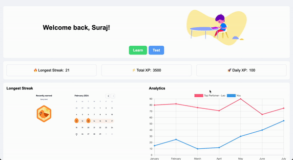

# BayHacks 2024 - Graphien Project

## Team Graphien
- Suraj
- Joe

## About
Welcome to the Graphien repository, our innovative project for the BayHacks 2024 event! Graphien is akin to Duolingo for learning how 
to write, designed to make the journey of mastering writing skills engaging, interactive, and accessible to everyone.

### Key Features
- **Interactive Lessons:** Step-by-step guides to improve your writing skills.
- **Progress Tracking:** Monitor your learning journey, build learning habits  and see your improvements over time.
- **Community Learning:** Connect with learners from around the globe and learn together.

## Getting Started

### Launching the App

### Minimum Viable Product (MVP)

Our MVP showcases the core functionality of Graphien, providing a sneak peek into the engaging learning experience we've built. Check 
out the features and give us your feedback!

